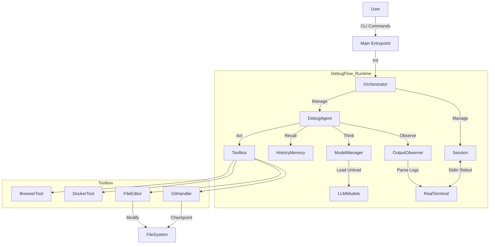

# DebugFlow (V1.1)

<p align="center">
  <a href="README_EN.md">English</a> | <a href="README.md">中文</a>
</p>

> **一个面向真实工程调试场景的 Agent Runtime，更是一个“工程化的 DebugFlow 雏形”。**  
> A Engineering-Grade DebugFlow Prototype for Real-World Debugging.

---

## 📌 系统架构 (System Architecture)

DebugFlow 不是线性的 LLM 问答，而是一个**基于状态机（State Machine）的闭环控制系统**。



---

## 🧱 核心模块说明

| 模块 | 职责 | 关键特性 |
| --- | --- | --- |
| **Session** | 任务运行时容器 | 异步、支持 PTY (伪终端)、可暂停/恢复、日志持久化 |
| **Orchestrator** | 总指挥 | 协调 Agent 与 Session，处理用户信号 (Ctrl+C)，管理生命周期 |
| **ModelManager** | 算力调度 | 显存互斥管理 (自动 Unload)、Token 计数、多后端支持 (Local/API) |
| **HistoryMemory** | 经验库 | 记录 `(Command, Error, Result)`，防止 Agent 陷入死循环 |
| **GitHandler** | 安全网 | 任何文件修改前强制 Commit，提供 `reset --hard` 回滚能力 |
| **Observer** | 感知器 | 实时流式分析终端输出，正则匹配错误类型 |

---

## 🚀 快速开始 (Quick Start)

### 1. 环境准备

```bash
# 1. 克隆项目
git clone https://github.com/LiangSu8899/agent.git agent-os
cd agent-os

# 2. 创建虚拟环境 (推荐 Python 3.10+)
python -m venv venv
source venv/bin/activate

# 3. 安装依赖
pip install -r requirements.txt
# 核心依赖：llama-cpp-python, duckduckgo-search, gitpython, docker, tiktoken, openai
```

### 2. 初始化配置

首次运行会自动生成 `config.yaml`，建议手动配置模型路径。

```bash
# 查看帮助并运行一次生成配置
python main.py --help
vim config.yaml
```

## 🚀 交互模式 (Interactive REPL) - *New in V1.1*

从 V1.1 版本开始，推荐使用交互式 REPL 模式。它提供了命令补全、历史记录和可视化状态面板。

### 启动
```bash
# 默认启动 REPL
python main.py

# 或者显式启动
python main.py repl
```

### Slash Commands (指令)
在 `[agent] >` 提示符下，你可以直接输入任务描述，也可以使用以下指令管理系统：

| 指令 | 说明 | 示例 |
| --- | --- | --- |
| `/model <name>` | 动态切换模型 (支持 API Key 自动录入) | `/model gpt-4` 或 `/model deepseek-coder` |
| `/cost` | 查看当前会话 Token 消耗与预估费用 | `/cost` |
| `/clear` | 清空当前上下文记忆 (Memory) | `/clear` |
| `/status` | 查看当前 Session 状态与显存占用 | `/status` |
| `/history` | 查看执行过的命令历史 | `/history` |
| `/config` | 查看当前生效配置 (已脱敏) | `/config` |
| `/help` | 显示帮助菜单 | `/help` |
| `/exit` | 退出程序 | `/exit` |

### 交互示例
```plaintext
[agent] > /model glm-4
✓ Switched to model: glm-4

[agent] > Fix the docker build error in current directory
⠋ Agent is thinking...
  ➜ Executing: docker build .
  ➜ Error detected: "COPY failed: file not found"
  ➜ Thinking: I need to check if the file exists...
  ➜ Executing: ls -la
  ...
✓ Task Completed.

[agent] > /cost
Total Tokens: 1,250 | Estimated Cost: $0.002
```

---

### 3. 启动任务

```bash
# 场景：你有一个 docker build 失败的项目
python main.py start "修复当前目录中的 docker build 错误"

# 场景：恢复之前的会话
python main.py resume session_20231011_123456
```

---

## 🧠 模型配置与更换指南

系统实现了 `LLMClient` 抽象，**无缝切换云端/本地模型**只需修改 `config.yaml`。

### 1. 配置文件结构 (`config.yaml`)

```yaml
models:
  # 规划模型 (Planner)：负责思考、决策、查错。推荐高智商模型。
  planner:
    type: "openai"  # 或 "local"
    model_name: "deepseek-chat"
    api_key: "sk-xxxxxxxx" 
    api_base: "https://api.deepseek.com/v1" # 兼容 OpenAI 格式
    temperature: 0.1

  # 编码模型 (Coder)：负责写代码、改文件。推荐代码能力强的模型。
  coder:
    type: "local"
    path: "/models/deepseek-coder-33b.gguf"
    n_ctx: 16384
    n_gpu_layers: -1 # 针对高性能 GPU (如 5090) 全部卸载
```

### 2. 运作原理

* **Local 模式**: `ModelManager` 调用 `llama-cpp-python` 加载 GGUF 到显存。如果切换角色，会自动 `unload` 前一个模型释放显存。
* **OpenAI 模式**: 实例化 `OpenAICompatibleClient`，直接发 HTTP 请求。显存占用为 0，适合将 Planner 部署在云端。

---

## ✅ 已完成功能 (V1.0 Kernel)

### 核心运行时 (Runtime):
- [x] **Async Session**: 支持长时间运行任务的异步会话管理。
- [x] **PTY Terminal**: 真正的伪终端交互 (支持 top, 进度条, Ctrl+C)。
- [x] **Signal Handling**: 优雅处理中断与恢复 (Pause/Resume)。

### 大脑与记忆 (Brain & Memory):
- [x] **Model Manager**: 本地显存互斥管理 (自动 Load/Unload GGUF 模型)。
- [x] **History Memory**: 基于 SQLite 的错误记忆库，防止重复犯错。
- [x] **Output Observer**: 流式日志分析与错误分类器。

### 工具与安全 (Tools & Safety):
- [x] **Git Safety Net**: 修改代码前强制自动 Commit，支持一键回滚。
- [x] **File Editor**: 基于 Search & Replace 的精准代码修改。
- [x] **Docker Tool**: 流式构建日志监控与容器操作。
- [x] **Browser Tool**: 报错信息联网搜索与摘要。

### 交互 (Interface):
- [x] **CLI**: start, resume, logs 命令行工具。
- [x] **Config System**: 基于 config.yaml 的灵活配置。

---

## 🛠️ 严谨工程化优化 Todo List (V2.0 Roadmap)

### 🔒 1. 安全边界 (Safety Guardrails) - **已实现 (V1.1)**
- [x] **实现 `SafetyPolicy` 类**：
  - **黑名单路径**: 禁止修改 `/etc`, `/usr`, `.git`, `config.yaml`。
  - **高危命令拦截**: 拦截 `rm -rf /`, `mkfs`, `dd` 等毁灭性命令。
  - **修改限流**: 单次 Step 最多修改 3 个文件，超过需人工审批。
- [ ] **沙箱化 (Sandbox)**: 让 Agent 只能在 Docker 容器内运行，挂载宿主机代码目录为 Volume。

### 🛑 2. 人类介入机制 (Human-in-the-Loop) - **中优先级**
- [ ] **引入 `WAITING_APPROVAL` 状态**: 当 `FileEditor` 准备修改文件时，展示 Diff 并等待确认。
- [ ] **紧急制动**: `Ctrl+D` 触发 `Emergency Stop`（杀进程 + Git Reset）。

### 🧠 3. 记忆与上下文优化 (Context Optimization)
- [ ] **滑动窗口上下文**: 实现 `LogSummarizer`，压缩超长日志。
- [ ] **跨 Session 记忆 (RAG)**: 建立全局 `knowledge.db`，记录历史项目的补坑经验。

### ☁️ 4. 云端与本地混合调度 (Hybrid Compute)
- [ ] **动态路由策略**: 简单任务 -> 本地模型；复杂推理 -> 云端模型。
- [ ] **成本监控**: 记录 Token 消耗与费用。

---

## 🔭 未来演进路线

1. **MCP (Model Context Protocol) 集成**: 使 Agent 能直接使用现成的 Tool (PostgreSQL, Slack, etc.)。
2. **Skill Library (技能库)**: 将成功的操作序列固化为可复用的 "Skill"。
3. **RL (Reinforcement Learning) 自进化**: 收集 DPO 数据集，针对项目风格微调专属模型。

---

## 📜 License

MIT License

---

## 📊 功能对比 (Comparison)

| 功能维度 | 功能点 | DebugFlow (Agent OS) | Claude Code (官方) | OpenCode / Interpreter | Oh-My-OpenCode |
| --- | --- | --- | --- | --- | --- |
| **核心定位** | 主要用途 | **深度工程调试 & 修复** | 通用代码辅助 & 问答 | 通用自动化 & 脚本执行 | 极客定制版自动化 |
| **算力模式** | 模型支持 | **本地(5090) + 云端混合** | 仅限 Anthropic 云端 | 任意 (本地/云端) | 任意 (本地/云端) |
| **执行环境** | 终端交互 (PTY) | **✅ (核心强项)** | ✅ | ⚠️ (部分 subprocess) | ⚠️ |
| | 状态保持 (Session) | **✅ (SQLite持久化)** | ❌ (退出即忘) | ⚠️ (运行时内存) | ⚠️ |
| | 长任务中断恢复 | **✅ (Pause/Resume)** | ❌ | ❌ | ❌ |
| | 进程级控制 | **✅ (Ctrl+C 优雅暂停)** | ⚠️ | ❌ (容易卡死) | ⚠️ |
| **安全性** | Git 自动快照 | **✅ (强制 Checkpoint)** | ❌ | ❌ (裸奔) | ❌ |
| | 沙箱/权限控制 | ⚠️ (Phase 7 Todo) | ⚠️ (云端环境) | ❌ (Root 裸奔) | ❌ |
| | 修改确认 | ⚠️ (Todo) | ✅ (每次确认) | ✅ (可选) | ✅ |
| **智能特性** | 错误记忆 (Memory) | **✅ (防重复犯错)** | ❌ | ❌ | ❌ |
| | 主动查错 (Observer) | **✅ (流式分析)** | ⚠️ | ❌ (靠 LLM 自己看) | ❌ |
| | 联网搜索 | **✅ (BrowserTool)** | ❌ (知识截止) | ✅ | ✅ |
| **交互体验** | 交互式 REPL | **✅ (Phase 8)** | ✅ (非常丝滑) | ✅ | ✅ |
| | Slash Commands | **✅ (/model, /cost)** | ✅ (/bug, /review) | ✅ (/save) | ✅ |
| | UI 美观度 | ⚠️ (基于 Rich) | **✅ (极致打磨)** | ⚠️ | ⚠️ |
| **生态** | MCP 协议支持 | 🔧 (架构支持, 待加) | ✅ (原生支持) | ⚠️ (试验中) | ⚠️ |
| | 多模型切换 | **✅ (GGUF/API 秒切)** | ❌ (仅 Claude) | ✅ | ✅ |

---

> **设计目标：让 Agent 像一个可靠的工程师，而不是话多的聊天机器人。**

