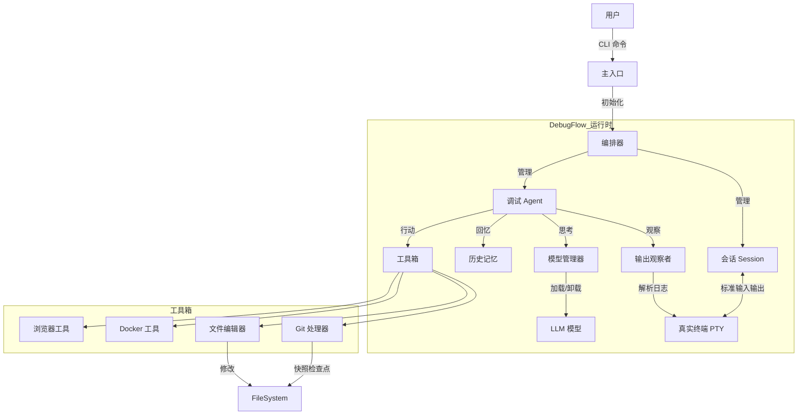

# DebugFlow (V1.3)

<p align="center">
<a href="README_EN.md">English</a> | <a href="README.md">中文</a>
</p>

> **一个调试优先的 Agent 运行时，更重要的是，一个“工程级的 DebugFlow 原型”。**
> 面向真实世界调试场景的工程级 DebugFlow 原型。

---

## 📌 系统架构 (System Architecture)

DebugFlow 不是一个线性的 LLM 问答系统，而是一个**基于状态机的闭环控制系统**。



---

## 🧱 核心模块 (Core Modules)

| 模块 | 职责 | 核心特性 |
| --- | --- | --- |
| **Session (会话)** | 任务运行时容器 | 异步支持、PTY 伪终端支持、暂停/恢复、日志持久化 |
| **Orchestrator (编排器)** | 总指挥 | 编排 Agent 与 Session，处理用户信号 (Ctrl+C)，生命周期管理 |
| **ModelManager (模型管理)** | 计算调度器 | 显存互斥管理 (自动卸载)、Token 计数、多后端支持 (本地/API) |
| **HistoryMemory (历史记忆)** | 经验库 | 记录 `(命令, 错误, 结果)` 三元组，防止 Agent陷入死循环 |
| **GitHandler (Git 处理器)** | 安全网 | 任何文件修改前强制 Git 提交，提供 `reset --hard` 回滚能力 |
| **Observer (观察者)** | 感知模块 | 实时流式日志分析，基于正则的错误匹配 |

---

## 🚀 快速开始 (Quick Start)

### 1. 环境准备

```bash
# 1. 克隆仓库
git clone https://github.com/LiangSu8899/agent.git agent-os
cd agent-os

# 2. 创建虚拟环境 (推荐 Python 3.10+)
python -m venv venv
source venv/bin/activate

# 3. 安装依赖 & 全局命令
pip install -r requirements.txt
pip install -e .
# 核心依赖: llama-cpp-python, duckduckgo-search, gitpython, docker, tiktoken, openai

```

---

## 📁 项目管理与启动指南 (V1.3 新增)

Agent OS 采用“全局配置 + 本地上下文”的管理模式（类似于 Git 或 VS Code）。

### 1. 启动逻辑

Agent 会根据你当前所在的目录自动检测上下文：

* **场景 A: 进入现有项目**
```bash
cd ~/my-backend-project
aos

```


**行为**: 检测到当前目录下存在 `.agent/` 文件夹。
**结果**: 自动加载该项目的历史记录和会话。状态栏显示 `[Proj: my-backend-project]`。
* **场景 B: 初始化新项目**
```bash
mkdir new-app && cd new-app
aos

```


**行为**: 未发现 `.agent/` 文件夹。
**提示**:
```plaintext
No project found in current directory.
[1] Initialize new project here? (.agent/)  # 在此初始化新项目？
[2] Open last project: /home/user/old-project # 打开上一个项目
[3] Exit # 退出
> 

```


选择 `1` 将创建 `.agent/` 并初始化该项目独立的数据库。
* **场景 C: 快速打开最近的工作区**
在任意目录下（例如 `~`）：
```bash
aos
# 选择 [2] Open last project

```


**结果**: Agent 自动切换目录 (`chdir`) 到上一个项目路径并加载它。

### 2. 配置文件路径

| 配置路径 | 作用 |
| --- | --- |
| `~/.agent_os/config.yaml` | **全局配置**: 存储 API Key、模型定义和默认角色设置。所有项目共享。 |
| `~/.agent_os/state.json` | **状态追踪**: 记录“最后打开的项目”路径。 |
| `./.agent/sessions.db` | **项目数据**: 本地项目的对话历史、错误日志和 Token 使用统计。 |

---

## 🚀 交互式 REPL

从 V1.1 版本开始，交互式 REPL 是使用 DebugFlow 的推荐方式。安装完成后，使用 `aos` 或 `agent-os` 启动。

### 启动方式

```bash
# 默认启动 REPL
aos

# 或者显式启动
aos repl

```

---

## 🎮 交互与混合模型指南 (V1.2 新增)

V1.2 引入了 **混合角色策略 (Hybrid Role Strategy)**，允许你为不同的职责分配不同的模型，以获得最佳的性能和成本效益。

### 1. 核心概念：角色 (Roles)

系统包含两个主要角色：

* 🧠 **Planner (规划者)**: 分析错误、调研修复方案、规划步骤。**推荐**: 高逻辑、低成本模型 (如 GLM-4, DeepSeek-V3)。
* 👨‍💻 **Coder (编码者)**: 编写代码、生成补丁。**推荐**: 高编程能力、长上下文模型 (如 DeepSeek-Coder, Claude-3.5)。

### 2. 状态栏

REPL 底部始终显示当前配置：

```plaintext
[Planner: glm-4-plus | Coder: deepseek-v3]

```

这表示 GLM-4 用于规划，DeepSeek 用于编码。

### 3. 斜杠指令 (Slash Commands)

| 指令 | 描述 | 示例 |
| --- | --- | --- |
| `/role <role> <model>` | **核心指令**: 将模型绑定到特定角色 | `/role planner glm-4-plus` |
| `/model <model>` | **快捷指令**: 将 Planner 和 Coder 设为同一个模型 | `/model gpt-4o` |
| `/roles` | 查看当前角色分配情况 | `/roles` |
| `/models` | 列出所有可用模型及价格 ($/1M tokens) | `/models` |
| `/status` | 查看当前项目路径和会话状态 | `/status` |
| `/project [path]` | 切换到指定项目或查看当前项目信息 | `/project ~/my-app` |
| `/projects` | 列出所有历史项目及最后活跃状态 | `/projects` |
| `/cost` | 查看各模型的 Token 用量和预估总成本 | `/cost` |
| `/clear` | 清除当前项目的记忆（其他项目不受影响） | `/clear` |
| `/config` | 查看已加载的全局配置 | `/config` |
| `/help` | 显示帮助菜单 | `/help` |
| `/exit` | 退出程序 | `/exit` |

---

### 4. 最佳实践配置

* 💰 **性价比最高 (推荐)**
```bash
/role planner deepseek-v3
/role coder deepseek-coder

```


* 🚀 **强力/专家模式 (解决疑难 Bug)**
```bash
/model gpt-4o

```


* 🛡️ **隐私/本地模式 (RTX 5090)**
```bash
/model local-deepseek-coder-v2

```


### 5. 补全提示

* 输入 `/role` 并按 **空格键**，查看 `planner` / `coder` 选项。
* 选择角色后，再次按 **空格键**，查看 `config.yaml` 中配置的模型列表。
* 支持模糊匹配——无需记住确切的模型名称。

---

### 3. 开启任务

```bash
# 场景: 修复当前目录下的 Docker 构建错误
python main.py start "Fix the docker build error in current directory"

# 场景: 恢复之前的会话
python main.py resume session_20231011_123456

```

---

## 🧠 模型配置指南

系统实现了 `LLMClient` 抽象，通过 `config.yaml` 支持 **云端模型与本地模型的无缝切换**。

### 1. 配置结构 (`config.yaml`)

```yaml
models:
  # Planner: 负责思考、决策和错误检测。
  planner:
    type: "openai"  # 或 "local"
    model_name: "deepseek-chat"
    api_key: "sk-xxxxxxxx" 
    api_base: "https://api.deepseek.com/v1" # 兼容 OpenAI 协议
    temperature: 0.1

  # Coder: 负责编写代码和修改文件。
  coder:
    type: "local"
    path: "/models/deepseek-coder-33b.gguf"
    n_ctx: 16384
    n_gpu_layers: -1 # 全部加载到 GPU (例如 RTX 5090)

```

### 2. 工作原理

* **Local 模式**: `ModelManager` 使用 `llama-cpp-python` 将 GGUF 模型加载到显存。切换角色时，它会自动 `unload` 上一个模型以释放显存。
* **OpenAI 模式**: 实例化 `OpenAICompatibleClient` 进行直接的 HTTP 请求。零显存占用，非常适合将 Planner 卸载到云端。

---

## ✅ 已实现功能 (V1.0 内核)

### 核心运行时 (Core Runtime):

* [x] **异步会话 (Async Session)**: 支持长任务的异步会话管理。
* [x] **PTY 终端**: 真实的伪终端交互 (支持 top, 进度条, Ctrl+C)。
* [x] **信号处理**: 优雅地处理暂停和恢复。

### 大脑与记忆 (Brain & Memory):

* [x] **模型管理器**: 本地显存互斥 (GGUF 模型的自动加载/卸载)。
* [x] **历史记忆**: 基于 SQLite 的错误记忆，防止重蹈覆辙。
* [x] **输出观察者**: 流式日志分析与错误分类。

### 工具与安全 (Tools & Safety):

* [x] **Git 安全网**: 代码修改前强制自动提交，支持一键回滚。
* [x] **文件编辑器**: 基于“搜索 & 替换”的精准代码修改。
* [x] **Docker 工具**: 流式构建日志监控与容器操作。
* [x] **浏览器工具**: 针对错误信息的在线搜索与摘要。
* [x] **完成度阀门 (Completion Gate)**: 循环与停滞检测，防止冗余操作。
* [x] **事件系统**: 15+ 种事件类型，实现跨阶段实时监控。
* [x] **技能系统**: 4 种预验证技能 (GitClone, PythonScript 等)。

### 接口 (Interface):

* [x] **CLI**: start, resume, logs 命令行工具。
* [x] **配置系统**: 基于 config.yaml 的灵活配置。

---

## 🛠️ 工程优化待办 (V2.0 路线图)

### 🔒 1. 安全护栏 (Safety Guardrails) - **已实现 (V1.1)**

* [x] **实现 `SafetyPolicy` 类**:
* **黑名单路径**: 禁止修改 `/etc`, `/usr`, `.git`, `config.yaml`。
* **危险命令拦截**: 拦截 `rm -rf /`, `mkfs`, `dd` 等。
* **速率限制**: 限制每步的文件修改次数。


* [ ] **沙箱化 (Sandboxing)**: 在 Docker 容器内运行 Agent，将宿主机代码挂载为卷。

### 🛑 2. 人类介入 (Human-in-the-Loop) - **中优先级**

* [ ] **引入 `WAITING_APPROVAL` 状态**: 在应用文件更改前暂停并展示 Diff。
* [ ] **紧急停止**: `Ctrl+D` 触发立即停止 (杀进程 + Git 重置)。

### 🧠 3. 上下文优化 (Context Optimization)

* [ ] **滑动窗口上下文**: 实现 `LogSummarizer` 压缩长日志输出。
* [x] **跨会话记忆 (历史持久化)**: 建立全局 `knowledge.db` 以复用调试经验。

### ☁️ 4. 混合计算 (Hybrid Compute)

* [ ] **动态路由**: 简单任务使用本地模型；复杂推理使用云端模型。
* [x] **成本监控**: 自动追踪 Token 用量和 API 成本 (/cost 命令)。

---

## 🔭 未来演进 (Future Evolution)

1. **MCP (模型上下文协议) 集成**: 允许 Agent 使用社区工具 (PostgreSQL, Slack 等)。
2. **技能库 (Skill Library)**: 将成功的操作序列持久化为可复用的“技能”。
3. **RL (强化学习) 自我进化**: 收集 DPO 数据集以微调项目专用模型。

---

### 关键演进

* **完成度阀门 (agent_core/completion.py)**: 防止无限循环或无意义的重试。
* **事件系统 (agent_core/events.py)**: 实时发射 AGENT_START, PLANNER_*, EXECUTOR_* 等事件。
* **技能库 (agent_core/skills.py)**: 包含 GitClone, PythonScript 等预验证技能。
* **成本监控**: `/cost` 命令支持多模型明细拆解。

---

## 📜 许可证 (License)

MIT License

---

## 📊 对比分析

| 功能维度 | 功能点 | DebugFlow (Agent OS) | Claude Code (官方) | OpenCode / Interpreter | Oh-My-OpenCode |
| --- | --- | --- | --- | --- | --- |
| **核心定位** | 主要用例 | **深度工程调试** | 代码辅助生成 & 问答 | 生成自动化 & 脚本 | 极客向自动化工具 |
| **计算模型** | 模型支持 | **本地 (5090) + 云端混合** | 仅 Anthropic 云端 | 任意 (本地/云端) | 任意 (本地/云端) |
| **执行环境** | 终端交互 | **✅ (核心优势)** | ✅ | ⚠️ (部分子进程) | ⚠️ |
|  | 会话持久化 | **✅ (SQLite 存储)** | ❌ (退出即忘) | ⚠️ (运行时内存) | ⚠️ |
|  | 长任务恢复 | **✅ (暂停/恢复)** | ❌ | ❌ | ❌ |
|  | 进程级控制 | **✅ (优雅 Ctrl+C)** | ⚠️ | ❌ (易假死) | ⚠️ |
| **安全性** | Git 自动快照 | **✅ (强制)** | ❌ | ❌ (裸奔模式) | ❌ |
|  | 沙箱/权限 | ⚠️ (阶段7 待办) | ⚠️ (仅云端) | ❌ (Root 权限) | ❌ |
|  | 人类介入 | ⚠️ (待办) | ✅ (每次变更) | ✅ (可选) | ✅ |
| **智能特性** | 失败记忆 | **✅ (基于 SQLite)** | ❌ | ❌ | ❌ |
|  | 主动观察者 | **✅ (流式分析)** | ⚠️ | ❌ (LLM 手动检查) | ❌ |
|  | 网络搜索 | **✅ (浏览器工具)** | ❌ (知识截止) | ✅ | ✅ |
| **交互体验** | 交互式 REPL | **✅ (阶段8)** | ✅ (高度打磨) | ✅ | ✅ |
|  | 斜杠指令 | **✅ (/model, /cost)** | ✅ (/bug, /review) | ✅ (/save) | ✅ |
|  | UI 美观度 | ⚠️ (基于 Rich) | **✅ (高度打磨)** | ⚠️ | ⚠️ |
| **生态系统** | MCP 协议 | 🔧 (架构支持) | ✅ (原生) | ⚠️ (实验性) | ⚠️ |
|  | 多模型支持 | **✅ (GGUF/API 切换)** | ❌ (仅 Claude) | ✅ | ✅ |

---

> **设计目标：让 Agent 成为一名可靠的工程师，而不是一个话痨聊天机器人。**