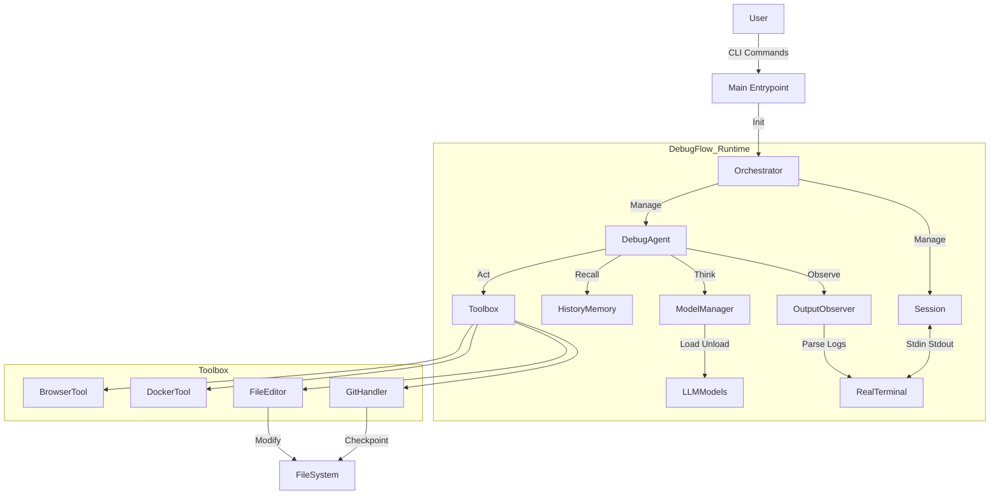

# DebugFlow (V1.3)

<p align="center">
  <a href="README_EN.md">English</a> | <a href="README.md">中文</a>
</p>

> **A Debug-First Agent Runtime, and more importantly, an "Engineering-Grade DebugFlow Prototype".**  
> A Engineering-Grade DebugFlow Prototype for Real-World Debugging.

---

## 📌 System Architecture

DebugFlow is not a linear LLM Q&A system, but a **closed-loop control system based on a State Machine**.



---

## 🧱 Core Modules

| Module | Responsibility | Key Features |
| --- | --- | --- |
| **Session** | Task runtime container | Async, PTY support, Pause/Resume, Log persistence |
| **Orchestrator** | Commander-in-Chief | Orchestrates Agent & Session, handles user signals (Ctrl+C), lifecycle management |
| **ModelManager** | Compute Scheduler | VRAM mutual exclusion (Auto Unload), Token counting, multi-backend (Local/API) |
| **HistoryMemory** | Experience Base | Records `(Command, Error, Result)`, prevents Agent from infinite loops |
| **GitHandler** | Safety Net | Mandatory Git commits before any file modification, `reset --hard` capability |
| **Observer** | Perception | Real-time streaming log analysis, regex-based error matching |

---

## 🚀 Quick Start

### 1. Environment Preparation

```bash
# 1. Clone the repo
git clone https://github.com/LiangSu8899/agent.git agent-os
cd agent-os

# 2. Create virtual environment (Python 3.10+ recommended)
python -m venv venv
source venv/bin/activate

# 3. Install dependencies & global command
pip install -r requirements.txt
pip install -e .
# Core dependencies: llama-cpp-python, duckduckgo-search, gitpython, docker, tiktoken, openai
```

---

## 📁 Project Management & Startup Guide (New in V1.3)

Agent OS uses a "Global Config + Local Context" management model (similar to Git or VS Code).

### 1. Startup Logic
Agent automatically detects context based on your current directory:

- **Scenario A: Entering an existing project**
  ```bash
  cd ~/my-backend-project
  aos
  ```
  **Behavior**: Detects `.agent/` folder in the current directory.  
  **Result**: Automatically loads the project history and session. Status bar shows `[Proj: my-backend-project]`.

- **Scenario B: Initializing a new project**
  ```bash
  mkdir new-app && cd new-app
  aos
  ```
  **Behavior**: No `.agent/` folder found.  
  **Prompt**:
  ```plaintext
  No project found in current directory.
  [1] Initialize new project here? (.agent/)
  [2] Open last project: /home/user/old-project
  [3] Exit
  > 
  ```
  Selecting `1` creates `.agent/` and initializes a standalone database for the project.

- **Scenario C: Quickly open the last workspace**
  From any directory (e.g., `~`):
  ```bash
  aos
  # Select [2] Open last project
  ```
  **Result**: Agent automatically changes directory (`chdir`) to the last project path and loads it.

### 2. Configuration Paths

| Config Path | Role |
| --- | --- |
| `~/.agent_os/config.yaml` | **Global Config**: Stores API Keys, model definitions, and default role settings. Shared across all projects. |
| `~/.agent_os/state.json` | **State Tracking**: Records the path of the "last opened project." |
| `./.agent/sessions.db` | **Project Data**: Local project conversation history, error logs, and token usage stats. |

---

## 🚀 Interactive REPL

From V1.1 onwards, the Interactive REPL is the recommended way to use DebugFlow. After installation, launch it with `aos` or `agent-os`.

### Launching
```bash
# Start REPL by default
aos

# Or explicitly launch it
aos repl
```

---

## 🎮 Interactive & Hybrid Model Guide (New in V1.2)

V1.2 introduces the **Hybrid Role Strategy**, allowing you to assign different models to specific responsibilities for optimal performance and cost.

### 1. Core Concept: Roles

The system consists of two primary roles:
- 🧠 **Planner**: Analyzes errors, researches fixes, and plans steps. Recommended: High-logic, low-cost models (e.g., GLM-4, DeepSeek-V3).
- 👨‍💻 **Coder**: Writes code and generates patches. Recommended: High-coding ability, long-context models (e.g., DeepSeek-Coder, Claude-3.5).

### 2. Status Bar
The bottom of the REPL always displays the current configuration:
```plaintext
[Planner: glm-4-plus | Coder: deepseek-v3]
```
This indicates GLM-4 is used for planning and DeepSeek for coding.

### 3. Slash Commands

| Command | Description | Example |
| --- | --- | --- |
| `/role <role> <model>` | **Core Command**: Bind a model to a specific role | `/role planner glm-4-plus` |
| `/model <model>` | **Shortcut**: Set both Planner and Coder to the same model | `/model gpt-4o` |
| `/roles` | View current role assignments | `/roles` |
| `/models` | List all available models and pricing ($/1M tokens) | `/models` |
| `/status` | View current project path and session status | `/status` |
| `/project [path]` | Switch to a specific project or view current project info | `/project ~/my-app` |
| `/projects` | List all historical projects and last active status | `/projects` |
| `/cost` | View per-model token usage and estimated total cost | `/cost` |
| `/clear` | Clear the memory of the current project (others unaffected) | `/clear` |
| `/config` | View the loaded global configuration | `/config` |
| `/help` | Show the help menu | `/help` |
| `/exit` | Exit the application | `/exit` |

---

### 4. Best Practice Configurations

- 💰 **Best Value (Recommended)**
  ```bash
  /role planner deepseek-v3
  /role coder deepseek-coder
  ```
- 🚀 **Power/Expert Mode (Hard bugs)**
  ```bash
  /model gpt-4o
  ```
- 🛡️ **Privacy/Local Mode (RTX 5090)**
  ```bash
  /model local-deepseek-coder-v2
  ```

### 5. Completion Tips
- Type `/role` and press **Space** to see `planner` / `coder` options.
- After selecting a role, press **Space** again to see the list of models from your `config.yaml`.
- Supports fuzzy matching—no need to remember exact model names.

---

### 3. Start a Task

```bash
# Scenario: Fixing a broken Docker build
python main.py start "Fix the docker build error in current directory"

# Scenario: Resume a previous session
python main.py resume session_20231011_123456
```

---

## 🧠 Model Configuration Guide

The system implements an `LLMClient` abstraction, allowing **seamless switching between Cloud and Local models** via `config.yaml`.

### 1. Configuration Structure (`config.yaml`)

```yaml
models:
  # Planner: Responsible for thinking, decision making, and error detection.
  planner:
    type: "openai"  # or "local"
    model_name: "deepseek-chat"
    api_key: "sk-xxxxxxxx" 
    api_base: "https://api.deepseek.com/v1" # OpenAI-compatible
    temperature: 0.1

  # Coder: Responsible for writing code and modifying files.
  coder:
    type: "local"
    path: "/models/deepseek-coder-33b.gguf"
    n_ctx: 16384
    n_gpu_layers: -1 # Offload all to GPU (e.g., RTX 5090)
```

### 2. How it Works

* **Local Mode**: `ModelManager` uses `llama-cpp-python` to load GGUF into VRAM. It automatically `unloads` the previous model when switching roles to free up VRAM.
* **OpenAI Mode**: Instantiates `OpenAICompatibleClient` for direct HTTP requests. Zero VRAM usage, ideal for offloading the Planner to the cloud.

---

## ✅ Implemented Features (V1.0 Kernel)

### Core Runtime:
- [x] **Async Session**: Asynchronous session management for long-running tasks.
- [x] **PTY Terminal**: Real pseudo-terminal interaction (supports top, progress bars, Ctrl+C).
- [x] **Signal Handling**: Graceful handling of pauses and resumes.

### Brain & Memory:
- [x] **Model Manager**: Local VRAM mutual exclusion (automatic Load/Unload of GGUF models).
- [x] **History Memory**: SQLite-based error memory to prevent repeating mistakes.
- [x] **Output Observer**: Streaming log analysis and error classification.

### Tools & Safety:
- [x] **Git Safety Net**: Mandatory auto-commits before code modification with one-click rollback.
- [x] **File Editor**: Precise code modification based on Search & Replace.
- [x] **Docker Tool**: Streaming build log monitoring and container operations.
- [x] **Browser Tool**: Online search and summarization for error messages.
- [x] **Completion Gate**: Loop and stall detection to prevent redundant actions.
- [x] **Event System**: 15+ event types for real-time monitoring across phases.
- [x] **Skill System**: 4 pre-validated skills (GitClone, PythonScript, etc.).

### Interface:
- [x] **CLI**: start, resume, logs command-line tools.
- [x] **Config System**: Flexible configuration based on config.yaml.

---

## 🛠️ Engineering Optimization Todo List (V2.0 Roadmap)

### 🔒 1. Safety Guardrails - **Implemented (V1.1)**
- [x] **Implement `SafetyPolicy` Class**:
  - **Blacklisted Paths**: Prevent modification of `/etc`, `/usr`, `.git`, `config.yaml`.
  - **Dangerous Command Interception**: Block `rm -rf /`, `mkfs`, `dd`, etc.
  - **Rate Limiting**: Limit the number of file modifications per step.
- [ ] **Sandboxing**: Run the Agent inside a Docker container, mounting the host code as a volume.

### 🛑 2. Human-in-the-Loop - **Medium Priority**
- [ ] **Introduce `WAITING_APPROVAL` State**: Pause and show Diffs before applying file changes.
- [ ] **Emergency Stop**: `Ctrl+D` triggers an immediate stop (kill process + Git Reset).

### 🧠 3. Context Optimization
- [ ] **Sliding Window Context**: Implement `LogSummarizer` to compress long log outputs.
- [x] **Cross-Session Memory (History Persistence)**: Establish a global `knowledge.db` to reuse debugging experiences.

### ☁️ 4. Hybrid Compute
- [ ] **Dynamic Routing**: Use local models for simple tasks; cloud models for complex reasoning.
- [x] **Cost Monitoring**: Automatic tracking of token usage and API costs (/cost command).

---

## 🔭 Future Evolution

1. **MCP (Model Context Protocol) Integration**: Allow the Agent to use community tools (PostgreSQL, Slack, etc.).
2. **Skill Library**: Persist successful operation sequences as reusable "Skills".
3. **RL (Reinforcement Learning) Self-Evolution**: Collect DPO datasets to fine-tune project-specific models.

---

### Key Evolution

- **Completion Gate (agent_core/completion.py)**: Prevents infinite loops or meaningless retries.
- **Event System (agent_core/events.py)**: Real-time emission of AGENT_START, PLANNER_*, EXECUTOR_*, etc.
- **Skill Library (agent_core/skills.py)**: Includes GitClone, PythonScript, and other pre-validated skills.
- **Cost Monitoring**: `/cost` command supports multi-model breakdown.

---

## 📜 License

MIT License

---

> **Design Goal: Make the Agent a reliable engineer, not a talkative chatbot.**