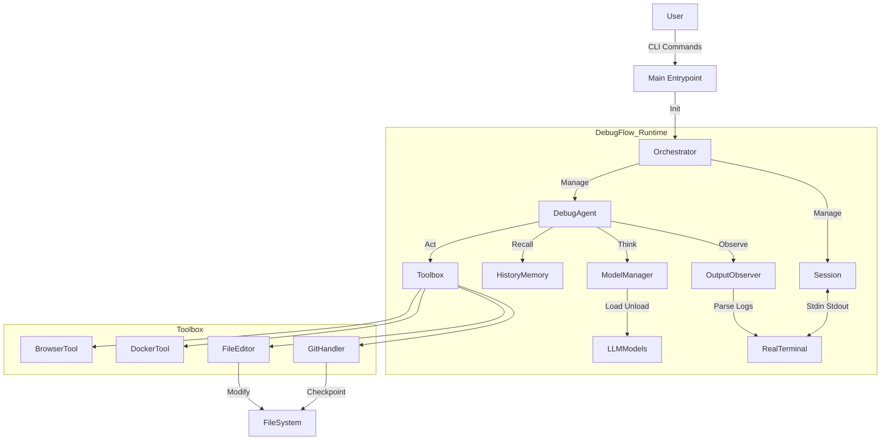

# DebugFlow (V1.1)

<p align="center">
  <a href="README_EN.md">English</a> | <a href="README.md">中文</a>
</p>

> **A Debug-First Agent Runtime, and more importantly, an "Engineering-Grade DebugFlow Prototype".**  
> A Engineering-Grade DebugFlow Prototype for Real-World Debugging.

---

## 📌 System Architecture

DebugFlow is not a linear LLM Q&A system, but a **closed-loop control system based on a State Machine**.



---

## 🧱 Core Modules

| Module | Responsibility | Key Features |
| --- | --- | --- |
| **Session** | Task runtime container | Async, PTY support, Pause/Resume, Log persistence |
| **Orchestrator** | Commander-in-Chief | Orchestrates Agent & Session, handles user signals (Ctrl+C), lifecycle management |
| **ModelManager** | Compute Scheduler | VRAM mutual exclusion (Auto Unload), Token counting, multi-backend (Local/API) |
| **HistoryMemory** | Experience Base | Records `(Command, Error, Result)`, prevents Agent from infinite loops |
| **GitHandler** | Safety Net | Mandatory Git commits before any file modification, `reset --hard` capability |
| **Observer** | Perception | Real-time streaming log analysis, regex-based error matching |

---

## 🚀 Quick Start

### 1. Environment Preparation

```bash
# 1. Clone the repo
git clone https://github.com/LiangSu8899/agent.git agent-os
cd agent-os

# 2. Create virtual environment (Python 3.10+ recommended)
python -m venv venv
source venv/bin/activate

# 3. Install dependencies
pip install -r requirements.txt
# Core dependencies: llama-cpp-python, duckduckgo-search, gitpython, docker, tiktoken, openai
```

### 2. Initial Configuration

`config.yaml` is generated automatically on first run, but manual configuration is recommended.

```bash
# View help and run once to generate config
python main.py --help
vim config.yaml
```

## 🚀 Interactive REPL - *New in V1.1*

Starting from V1.1, the Interactive REPL mode is highly recommended. It features command completion, command history, and a visual status panel.

### Launching
```bash
# Start REPL by default
python main.py

# Or explicitly launch it
python main.py repl
```

### Slash Commands
Within the `[agent] >` prompt, you can input tasks directly or use these commands to manage the system:

| Command | Description | Example |
| --- | --- | --- |
| `/model <name>` | Hot-switch models (supports auto API Key entry) | `/model gpt-4` or `/model deepseek-coder` |
| `/cost` | View token usage and estimated cost for the current session | `/cost` |
| `/clear` | Clear the current context memory | `/clear` |
| `/status` | View current session status and VRAM usage | `/status` |
| `/history` | View execution command history | `/history` |
| `/config` | View current configuration (sanitized) | `/config` |
| `/help` | Show the help menu | `/help` |
| `/exit` | Exit the application | `/exit` |

### Interaction Example
```plaintext
[agent] > /model gpt-4o
✓ Switched to model: gpt-4o

[agent] > Fix the docker build error in current directory
⠋ Agent is thinking...
  ➜ Executing: docker build .
  ➜ Error detected: "COPY failed: file not found"
  ➜ Thinking: I need to check if the file exists...
  ➜ Executing: ls -la
  ...
✓ Task Completed.

[agent] > /cost
Total Tokens: 1,250 | Estimated Cost: $0.002
```

---

### 3. Start a Task

```bash
# Scenario: Fixing a broken Docker build
python main.py start "Fix the docker build error in current directory"

# Scenario: Resume a previous session
python main.py resume session_20231011_123456
```

---

## 🧠 Model Configuration Guide

The system implements an `LLMClient` abstraction, allowing **seamless switching between Cloud and Local models** via `config.yaml`.

### 1. Configuration Structure (`config.yaml`)

```yaml
models:
  # Planner: Responsible for thinking, decision making, and error detection.
  planner:
    type: "openai"  # or "local"
    model_name: "deepseek-chat"
    api_key: "sk-xxxxxxxx" 
    api_base: "https://api.deepseek.com/v1" # OpenAI-compatible
    temperature: 0.1

  # Coder: Responsible for writing code and modifying files.
  coder:
    type: "local"
    path: "/models/deepseek-coder-33b.gguf"
    n_ctx: 16384
    n_gpu_layers: -1 # Offload all to GPU (e.g., RTX 5090)
```

### 2. How it Works

* **Local Mode**: `ModelManager` uses `llama-cpp-python` to load GGUF into VRAM. It automatically `unloads` the previous model when switching roles to free up VRAM.
* **OpenAI Mode**: Instantiates `OpenAICompatibleClient` for direct HTTP requests. Zero VRAM usage, ideal for offloading the Planner to the cloud.

---

## ✅ Implemented Features (V1.0 Kernel)

### Core Runtime:
- [x] **Async Session**: Asynchronous session management for long-running tasks.
- [x] **PTY Terminal**: Real pseudo-terminal interaction (supports top, progress bars, Ctrl+C).
- [x] **Signal Handling**: Graceful handling of pauses and resumes.

### Brain & Memory:
- [x] **Model Manager**: Local VRAM mutual exclusion (automatic Load/Unload of GGUF models).
- [x] **History Memory**: SQLite-based error memory to prevent repeating mistakes.
- [x] **Output Observer**: Streaming log analysis and error classification.

### Tools & Safety:
- [x] **Git Safety Net**: Mandatory auto-commits before code modification with one-click rollback.
- [x] **File Editor**: Precise code modification based on Search & Replace.
- [x] **Docker Tool**: Streaming build log monitoring and container operations.
- [x] **Browser Tool**: Online search and summarization for error messages.

### Interface:
- [x] **CLI**: start, resume, logs command-line tools.
- [x] **Config System**: Flexible configuration based on config.yaml.

---

## 🛠️ Engineering Optimization Todo List (V2.0 Roadmap)

### 🔒 1. Safety Guardrails - **Implemented (V1.1)**
- [x] **Implement `SafetyPolicy` Class**:
  - **Blacklisted Paths**: Prevent modification of `/etc`, `/usr`, `.git`, `config.yaml`.
  - **Dangerous Command Interception**: Block `rm -rf /`, `mkfs`, `dd`, etc.
  - **Rate Limiting**: Limit the number of file modifications per step.
- [ ] **Sandboxing**: Run the Agent inside a Docker container, mounting the host code as a volume.

### 🛑 2. Human-in-the-Loop - **Medium Priority**
- [ ] **Introduce `WAITING_APPROVAL` State**: Pause and show Diffs before applying file changes.
- [ ] **Emergency Stop**: `Ctrl+D` triggers an immediate stop (kill process + Git Reset).

### 🧠 3. Context Optimization
- [ ] **Sliding Window Context**: Implement `LogSummarizer` to compress long log outputs.
- [ ] **Cross-Session Memory (RAG)**: Establish a global `knowledge.db` to reuse debugging experiences across projects.

### ☁️ 4. Hybrid Compute
- [ ] **Dynamic Routing**: Use local models for simple tasks; cloud models for complex reasoning.
- [ ] **Cost Monitoring**: Track token usage and API costs.

---

## 🔭 Future Evolution

1. **MCP (Model Context Protocol) Integration**: Allow the Agent to use community tools (PostgreSQL, Slack, etc.).
2. **Skill Library**: Persist successful operation sequences as reusable "Skills".
3. **RL (Reinforcement Learning) Self-Evolution**: Collect DPO datasets to fine-tune project-specific models.

---

## 📜 License

MIT License

---

## 📊 Comparison

| Feature Dimension | Feature Point | DebugFlow (Agent OS) | Claude Code (Official) | OpenCode / Interpreter | Oh-My-OpenCode |
| --- | --- | --- | --- | --- | --- |
| **Core Positioning** | Primary Use Case | **Deep Engineering Debugging** | Gen. Code Assist & Q&A | Gen. Automation & Scripts | Geek-focused Automation |
| **Compute Model** | Model Support | **Local (5090) + Cloud Hybrid** | Anthropic Cloud Only | Any (Local/Cloud) | Any (Local/Cloud) |
| **Execution Env** | Terminal Interaction | **✅ (Core Strength)** | ✅ | ⚠️ (Partial subprocess) | ⚠️ |
| | Session Persistence | **✅ (SQLite Storage)** | ❌ (Forget on exit) | ⚠️ (Runtime memory) | ⚠️ |
| | Long-task Resume | **✅ (Pause/Resume)** | ❌ | ❌ | ❌ |
| | Process-level Control | **✅ (Graceful Ctrl+C)** | ⚠️ | ❌ (Prone to hanging) | ⚠️ |
| **Safety** | Git Auto-Snapshot | **✅ (Mandatory)** | ❌ | ❌ (Raw mode) | ❌ |
| | Sandbox/Permissions | ⚠️ (Phase 7 Todo) | ⚠️ (Cloud only) | ❌ (Root access) | ❌ |
| | Human-in-the-loop | ⚠️ (Todo) | ✅ (Every change) | ✅ (Optional) | ✅ |
| **Smart Features** | Failure Memory | **✅ (SQLite-based)** | ❌ | ❌ | ❌ |
| | Active Observer | **✅ (Stream analysis)** | ⚠️ | ❌ (LLM manual check) | ❌ |
| | Web Search | **✅ (BrowserTool)** | ❌ (Knowledge cutoff) | ✅ | ✅ |
| **Interactive Exp** | Interactive REPL | **✅ (Phase 8)** | ✅ (Highly polished) | ✅ | ✅ |
| | Slash Commands | **✅ (/model, /cost)** | ✅ (/bug, /review) | ✅ (/save) | ✅ |
| | UI Aesthetics | ⚠️ (Base on Rich) | **✅ (Highly polished)** | ⚠️ | ⚠️ |
| **Ecosystem** | MCP Protocol | 🔧 (Arch support) | ✅ (Native) | ⚠️ (Experimental) | ⚠️ |
| | Multi-model Support | **✅ (GGUF/API Switch)** | ❌ (Claude only) | ✅ | ✅ |

---

> **Design Goal: Make the Agent a reliable engineer, not a talkative chatbot.**