# Project Inspection Report

**Generated**: 2026-01-12T00:10:06.064885
**Project Path**: /home/heima/suliang/main/agent/tests/scenarios/dummy_broken_calculator

## Project Summary

| Property | Value |
|----------|-------|
| **Type** | unknown |
| **Language** | Unknown |
| **Entry Point** | N/A |
| **Build Tool** | N/A |

## Architecture

```mermaid
graph TD
  main["🚀 main"]
  calc["⚙️ calc"]
  utils["🔧 utils"]
  test_calc["✅ test_calc"]
  main --> calc

```



## Detected Modules

| Module | Path | Responsibility | Test File |
|--------|------|-----------------|-----------|
| utils | utils.py | Utility functions and helpers | ❌ Not found |
| test_calc | test_calc.py | Unit/integration tests | ❌ Not found |
| main | main.py | Entry point and CLI handling | ❌ Not found |
| calc | calc.py | Core logic and processing | test_calc.py |

## Test Targets (3 found)

### T1: Verify utils (Utility functions and helpers)

- **Module**: utils
- **Risk Level**: medium
- **Estimated Time**: 1.0m
- **Verification Command**:
  ```bash
  python -m pytest utils_test.py -v
  ```

### T2: Verify main (Entry point and CLI handling)

- **Module**: main
- **Risk Level**: medium
- **Estimated Time**: 1.0m
- **Verification Command**:
  ```bash
  python -m pytest main_test.py -v
  ```

### T3: Test calc (Core logic and processing)

- **Module**: calc
- **Risk Level**: low
- **Estimated Time**: 0.5m
- **Verification Command**:
  ```bash
  python -m pytest test_calc.py -v
  ```

## Recommended Debug Order

1. Start with LOW risk tests
2. Move to MEDIUM risk tests
3. Address HIGH risk tests
4. Review CRITICAL issues

## Next Steps

- Review test targets above
- Run tests in recommended order
- Fix identified issues
- Verify with regression tests
